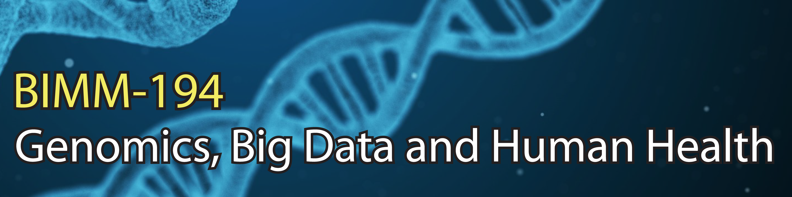

 
**Overview**: The Big Data revolution in Biology and health care is here.  This 2-unit BIMM-194 course at UC San Diego reviews how recent advances, particularly in genomics, have the exciting potential to shift medicine from a reactive practice of treating symptoms and diseases, to one where disease risk is diagnosed early or even managed prior to onset.

 
**Description**: Imagine a world in which you can input your age, lifestyle and genomic information into an App to obtain personalized recommendations for maintaining your health. This might include the food you should eat and not eat, drugs you should take and avoid, and even specific behaviors to adopt.  

Furthermore, imagine that when you are sick, your doctor inputs the same information, together with your electronic health record, to determine your customized treatment and health management plan. This world is not 30 years in the future but beginning to unfold now.  

This course reviews how recent genomic and bioinformatic advances are poised to revolutionize health care. This includes the latest developments in personalized medicine (a.k.a. precision medicine), disease screening, targeted immunotherapy based cancer treatments, pharmacogenomics, and how microbiome and epigenetic factors impact health.  

 
**Audience & prerequisites**:  Biology majors with upper division standing. A familiarity with basic biomedical concepts is essential (students should have successfully completed Molecular Biology (BIMM 100).  

 
**Schedule**:  Class will meet once a week from 2:00-3:20pm on Fridays of the Winter term in York Hall Rm. 3010.  

 
**Class announcements**:  All announcements regarding the course will be by email to your UCSD address.  

 
**Requirements**: Students MUST bring their own WiFi enabled laptop to lectures to fully benefit from the online reading activities.   

 
**Objectives**:  
At the end of this course students will be able to:
- Describe human genome structure and how genomes differ between individuals.
- Appreciate and be able to describe in general terms the recent rapid advances in sequencing technologies and understand the process by which genomes are currently sequenced.
- Develop an understanding of how genomics can inform us about disease risks. 
- Critically evaluate and summarize primary research literature in the genomics area.
- Discuss major ethical, legal and social implications of advances in genomic technologies.
- Utilize terminology such as gene, genotype, phenotype, variant, variants of unknown significance, traits, multifactorial disease, SNP, genetic test, pharmacogenomics, epigenetics, microbiome, whole genome sequencing and exome sequencing.

 
**Office hours & location**:  TBD – For now email me for a time and we will make it happen.

 
**Grading**:  Letter grades (F through A+) will be assigned on the basis of student presentations (50 points), homework and in-class quiz assignments (25 points), contributions to class discussion (15 points), and attendance (10 points). Further details will be given in class.  

Note, there is no final exam or mid-term for this course.  

 
**Professor**:  
Dr. Barry Grant  
Division of Biological Sciences,  
Section of Molecular Biology,  
Univ. California San Diego.  

Email: <bjgrant@ucsd.edu>  
Web: <http://thegrantlab.org>

